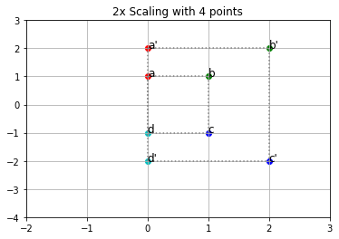
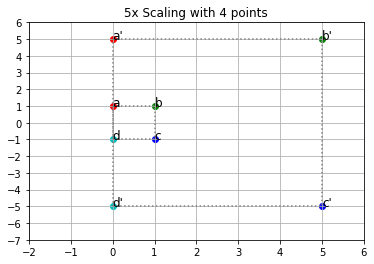

```python
import matplotlib.pyplot as plt
import numpy as np
import string
import math
color_lut = 'rgbc'
```


```python
#
a, b, c, d = (0, 1, 0), (1, 1, 1), (1, -1, 2), (0, -1, 3)

# matrix with row vectors of points
A = np.array([a, b, c, d])

# membuat matriks identitas
I = np.eye(3)
print (len(A))
print(I)
```

    4
    [[1. 0. 0.]
     [0. 1. 0.]
     [0. 0. 1.]]
    


```python
def first_shape(I) :
    list_x = []
    list_y = []
    for row in A:
        output_row = I @ row
        x, y, i = output_row
        list_x.append(x)
        list_y.append(y)
    list_x.append(list_x[0])
    list_y.append(list_y[0])
    return list_x , list_y
```

# Scalling


```python
def scaling(n) :
    matriks = np.array([[n, 0, 0], [0, n, 0], [0, 0, 1]])
    list_x, list_y = first_shape(I)
    list_x_2, list_y_2 = first_shape(matriks)
    fig = plt.figure()
    gca = plt.gca()
    for i in range (0,len(list_x)-1) :
        x = list_x[i]
        y = list_y[i]
        x_2 = list_x_2[i]
        y_2 = list_y_2[i]
        c = color_lut[i]
        plt.scatter(x, y, color=c)
        plt.scatter(x_2, y_2, color=c)
        plt.text(x, y, f"{string.ascii_letters[i]}", fontsize='large')
        plt.text(x_2, y_2, f"{string.ascii_letters[i]}'", fontsize='large')
    
    plt.plot(list_x, list_y, color="gray", linestyle='dotted')
    plt.plot(list_x_2, list_y_2, color="gray", linestyle='dotted')
    gca.set_xticks(np.arange(min(list_x_2)-2, max(list_x_2)+2, 1))
    gca.set_yticks(np.arange(min(list_y_2)-2, max(list_y_2)+2, 1))
    plt.grid()
    plt.title(str(n)+'x Scaling with '+str(len(A))+' points')
    plt.show()
```


```python
scaling(2)
scaling(5)
# points a, b and, c
a, b, c = (0, 5, 0), (5, 5, 1), (5, -5, 2)

# matrix with row vectors of points
A = np.array([a, b, c])
scaling(2)

```








# Translation


```python
def translation(tx, ty) :
    fig = plt.figure()
    gca = plt.gca()
    matriks = np.array([[1, 0, tx], [0, 1, ty], [0, 0, 1]])
    list_x, list_y = first_shape(I)
    list_x_2 = []
    list_y_2 = []
    sum_tran = 0
    for row in A:
        x_2, y_2, i_r = row
        x_2 += matriks[0][len(matriks[0])-1]
        y_2 += matriks[1][len(matriks[1])-1]
        c_r = color_lut[sum_tran]
        letter_r = string.ascii_letters[sum_tran]
        plt.scatter(x_2, y_2, color=c_r)
        plt.text(x_2+0.1, y_2, f"{letter_r}'", fontsize='large')
        list_x_2.append(x_2)
        list_y_2.append(y_2)
        sum_tran +=1
    
    list_x_2.append(list_x_2[0])
    list_y_2.append(list_y_2[0])
    
    for i in range (0,len(list_x)-1) :
        x = list_x[i]
        y = list_y[i]
        c = color_lut[i]
        plt.scatter(x, y, color=c)
        plt.text(x, y, f"{string.ascii_letters[i]}", fontsize='large')

    
    plt.plot(list_x, list_y, color="gray", linestyle='dotted')
    plt.plot(list_x_2, list_y_2, color="black", linestyle='dotted')
    gca.set_xticks(np.arange(min(list_x)-2, max(list_x_2)+2, 1))
    gca.set_yticks(np.arange(min(list_y)-2, max(list_y_2)+2, 1))
    plt.grid()
    plt.title('Translation x = '+str(tx)+' ,y = '+str(ty)+' with '+str(len(A))+' points')
    plt.show()

```


```python
translation(2,2)
translation(2,6)
# points a, b, c, d
a, b, c, d = (0, 1, 0), (1, 1, 1), (1, -1, 2), (0, -1, 3)

# matrix with row vectors of points
A = np.array([a, b, c, d])
translation(2,3)
```


# Rotation


```python
def rotation(angle) :
    fig = plt.figure()
    gca = plt.gca()
    matriks = np.array([[math.cos(math.radians(angle)),math.sin(math.radians(angle)), 0], [-math.sin(math.radians(angle)), math.cos(math.radians(angle)),0], [0, 0, 1]])
    list_x, list_y = first_shape(I)
    list_x_2 = []
    list_y_2 = []
    sum_tran = 0
    for row in A:
        out_row = matriks @ row
        x_2, y_2, i_r = out_row
        #x_2 = (x_2*matriks[0][0])+(y_2*matriks[1][1])
        #y_2 = (x_2*matriks[0][0])+(y_2*matriks[0][1])
        c_r = color_lut[sum_tran]
        letter_r = string.ascii_letters[sum_tran]
        plt.scatter(x_2, y_2, color=c_r)
        plt.text(x_2+0.1, y_2, f"{letter_r}'", fontsize='large')
        list_x_2.append(x_2)
        list_y_2.append(y_2)
        sum_tran +=1
    
    list_x_2.append(list_x_2[0])
    list_y_2.append(list_y_2[0])
    
    for i in range (0,len(list_x)-1) :
        x = list_x[i]
        y = list_y[i]
        c = color_lut[i]
        plt.scatter(x, y, color=c)
        plt.text(x, y, f"{string.ascii_letters[i]}", fontsize='large')

    
    plt.plot(list_x, list_y, color="gray", linestyle='dotted')
    plt.plot(list_x_2, list_y_2, color="black", linestyle='dotted')
    gca.set_xticks(np.arange(min(list_x)-2, max(list_x_2)+2, 1))
    gca.set_yticks(np.arange(min(list_y)-2, max(list_y_2)+2, 1))
    plt.grid()
    plt.title('Rotation with '+str(angle)+' degrees and with '+str(len(A))+' points')
    plt.show()
```


```python
rotation(45)
rotation(90)
# points a, b and, c
a, b, c = (0, 5, 0), (5, 5, 1), (5, -5, 2)

# matrix with row vectors of points
A = np.array([a, b, c])
rotation(45)
```


# Projectives (Horizontal Shear)


```python
def horizontal_shear(sv) :
    fig = plt.figure()
    gca = plt.gca()
    matriks = np.array([[1,0, 0], [sv, 1,0], [0, 0, 1]])
    list_x, list_y = first_shape(I)
    list_x_2 = []
    list_y_2 = []
    sum_tran = 0
    for row in A:
        out_row = matriks @ row
        x_2, y_2, i_r = out_row
        #x_2 = (x_2)+(y_2*matriks[1][0])
        c_r = color_lut[sum_tran]
        letter_r = string.ascii_letters[sum_tran]
        plt.scatter(x_2, y_2, color=c_r)
        plt.text(x_2+0.1, y_2, f"{letter_r}'", fontsize='large')
        list_x_2.append(x_2)
        list_y_2.append(y_2)
        sum_tran +=1
    
    list_x_2.append(list_x_2[0])
    list_y_2.append(list_y_2[0])
    
    for i in range (0,len(list_x)-1) :
        x = list_x[i]
        y = list_y[i]
        c = color_lut[i]
        plt.scatter(x, y, color=c)
        plt.text(x, y, f"{string.ascii_letters[i]}", fontsize='large')

    
    plt.plot(list_x, list_y, color="gray", linestyle='dotted')
    plt.plot(list_x_2, list_y_2, color="black", linestyle='dotted')
    gca.set_xticks(np.arange(min(list_x_2)-2, max(list_x_2)+2, 1))
    gca.set_yticks(np.arange(min(list_y)-2, max(list_y_2)+2, 1))
    plt.grid()
    plt.title('Horizontal with sv = '+str(sv)+' and with '+str(len(A))+' points')
    plt.show()
```


```python
horizontal_shear(2)
horizontal_shear(3)
# points a, b, c, d
a, b, c, d = (0, 1, 0), (1, 1, 1), (1, -1, 2), (0, -1, 3)

# matrix with row vectors of points
A = np.array([a, b, c, d])
horizontal_shear(2)
```


# Projectives (Vertical Shear)


```python
def vertical_shear(sh) :
    fig = plt.figure()
    gca = plt.gca()
    matriks = np.array([[1,sh, 0], [0, 1,0], [0, 0, 1]])
    list_x, list_y = first_shape(I)
    list_x_2 = []
    list_y_2 = []
    sum_tran = 0
    for row in A:
        out_row = matriks @ row
        x_2, y_2, i_r = out_row
        #y_2 = (y_2)+(x_2*matriks[0][1])
        c_r = color_lut[sum_tran]
        letter_r = string.ascii_letters[sum_tran]
        plt.scatter(x_2, y_2, color=c_r)
        plt.text(x_2+0.1, y_2, f"{letter_r}'", fontsize='large')
        list_x_2.append(x_2)
        list_y_2.append(y_2)
        sum_tran +=1
    
    list_x_2.append(list_x_2[0])
    list_y_2.append(list_y_2[0])
    
    for i in range (0,len(list_x)-1) :
        x = list_x[i]
        y = list_y[i]
        c = color_lut[i]
        plt.scatter(x, y, color=c)
        plt.text(x, y, f"{string.ascii_letters[i]}", fontsize='large')

    
    plt.plot(list_x, list_y, color="gray", linestyle='dotted')
    plt.plot(list_x_2, list_y_2, color="black", linestyle='dotted')
    gca.set_xticks(np.arange(min(list_x)-2, max(list_x_2)+2, 1))
    gca.set_yticks(np.arange(min(list_y_2)-2, max(list_y_2)+2, 1))
    plt.grid()
    plt.title('Vertical with sh = '+str(sh)+' and with '+str(len(A))+' points')
    plt.show()
```


```python
vertical_shear(2)
vertical_shear(5)
# points a, b and, c
a, b, c = (0, 5, 0), (5, 5, 1), (5, -5, 2)

# matrix with row vectors of points
A = np.array([a, b, c])
vertical_shear(2)
```


```python
# points a, b, c, d
a, b, c, d = (0, 1, 0), (1, 1, 1), (1, -1, 2), (0, -1, 3)

# matrix with row vectors of points
A = np.array([a, b, c, d])
scaling(4)
translation(2,3)
```


```python
# points a, b, c, d
a, b, c, d = (0, 1, 0), (1, 1, 1), (1, -1, 2), (0, -1, 3)

# matrix with row vectors of points
A = np.array([a, b, c, d])
scaling(4)
translation(2,3)
```


